# InSee 앱 아이콘 검증

총 115개 앱 | 아이콘 115개

아이콘이 잘못된 앱은 ❌ 표시해주세요. 수동으로 교체할게요.

---

## 뤼이드 튜터

- **ID**: `wwit_ruiiidtutor`
- **카테고리**: Education | **지역**: Korea
- **아이콘**: ✅ `wwit_ruiiidtutor.png`
- **아이콘 미리보기**: 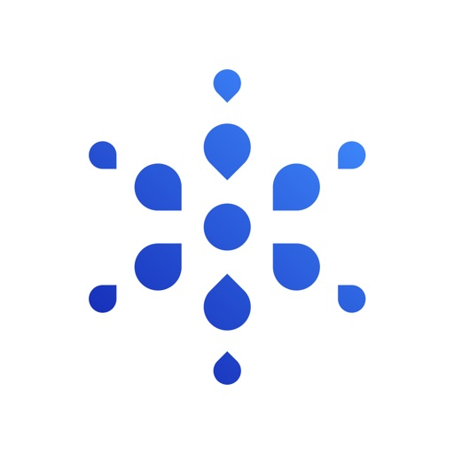
- **확인**: [ ] 정확 / [ ] 잘못됨 — 메모: 

## Duolingo

- **ID**: `duolingo`
- **카테고리**: Education | **지역**: Global
- **아이콘**: ✅ `duolingo.png`
- **아이콘 미리보기**: 
- **확인**: [ ] 정확 / [ ] 잘못됨 — 메모: 

## V LIVE

- **ID**: `wwit_vlive`
- **카테고리**: Entertainment | **지역**: Korea
- **아이콘**: ✅ `wwit_vlive.png`
- **아이콘 미리보기**: 
- **확인**: [ ] 정확 / [ ] 잘못됨 — 메모: 

## ZEPETO

- **ID**: `wwit_zepeto`
- **카테고리**: Entertainment | **지역**: Korea
- **아이콘**: ✅ `wwit_zepeto.png`
- **아이콘 미리보기**: 
- **확인**: [ ] 정확 / [ ] 잘못됨 — 메모: 

## 다음 웹툰

- **ID**: `wwit_daumwebtoon`
- **카테고리**: Entertainment | **지역**: Korea
- **아이콘**: ✅ `wwit_daumwebtoon.png`
- **아이콘 미리보기**: 
- **확인**: [ ] 정확 / [ ] 잘못됨 — 메모: 

## 카카오웹툰

- **ID**: `wwit_kakaowebtoon`
- **카테고리**: Entertainment | **지역**: Korea
- **아이콘**: ✅ `wwit_kakaowebtoon.png`
- **아이콘 미리보기**: 
- **확인**: [ ] 정확 / [ ] 잘못됨 — 메모: 

## 네이버페이 - 자산, 혜택, 현장결제

- **ID**: `네이버페이_-_자산,_혜택,_현장결제`
- **카테고리**: Finance | **지역**: Korea
- **아이콘**: ✅ `네이버페이_-_자산,_혜택,_현장결제.png`
- **아이콘 미리보기**: 
- **확인**: [ ] 정확 / [ ] 잘못됨 — 메모: 

## 뱅크샐러드 Banksalad

- **ID**: `뱅크샐러드_banksalad`
- **카테고리**: Finance | **지역**: Korea
- **아이콘**: ✅ `뱅크샐러드_banksalad.png`
- **아이콘 미리보기**: 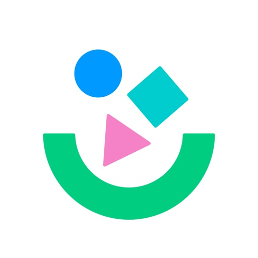
- **확인**: [ ] 정확 / [ ] 잘못됨 — 메모: 

## 삼쩜삼

- **ID**: `삼쩜삼`
- **카테고리**: Finance | **지역**: Korea
- **아이콘**: ✅ `삼쩜삼.png`
- **아이콘 미리보기**: 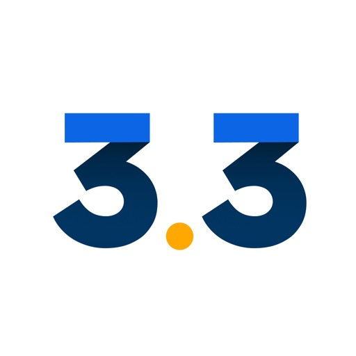
- **확인**: [ ] 정확 / [ ] 잘못됨 — 메모: 

## 신한플레이

- **ID**: `신한플레이`
- **카테고리**: Finance | **지역**: Korea
- **아이콘**: ✅ `신한플레이.png`
- **아이콘 미리보기**: 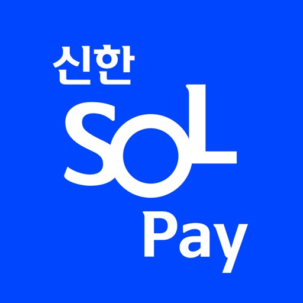
- **확인**: [ ] 정확 / [ ] 잘못됨 — 메모: 

## 차이 CHAI

- **ID**: `차이_chai`
- **카테고리**: Finance | **지역**: Korea
- **아이콘**: ✅ `차이_chai.png`
- **아이콘 미리보기**: 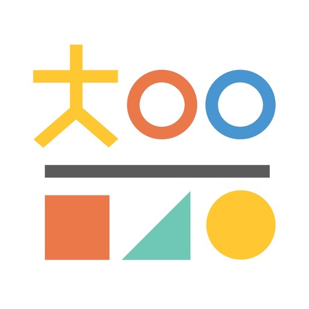
- **확인**: [ ] 정확 / [ ] 잘못됨 — 메모: 

## 카카오페이

- **ID**: `카카오페이`
- **카테고리**: Finance | **지역**: Korea
- **아이콘**: ✅ `카카오페이.png`
- **아이콘 미리보기**: 
- **확인**: [ ] 정확 / [ ] 잘못됨 — 메모: 

## ministock

- **ID**: `wwit_ministock`
- **카테고리**: Finance | **지역**: Korea
- **아이콘**: ✅ `wwit_ministock.png`
- **아이콘 미리보기**: 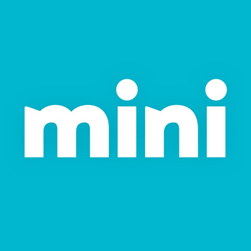
- **확인**: [ ] 정확 / [ ] 잘못됨 — 메모: 

## 도미노

- **ID**: `wwit_domino`
- **카테고리**: Finance | **지역**: Korea
- **아이콘**: ✅ `wwit_domino.png`
- **아이콘 미리보기**: 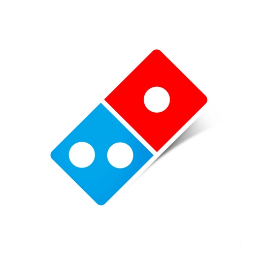
- **확인**: [ ] 정확 / [ ] 잘못됨 — 메모: 

## 모니모

- **ID**: `wwit_monimo`
- **카테고리**: Finance | **지역**: Korea
- **아이콘**: ✅ `wwit_monimo.png`
- **아이콘 미리보기**: 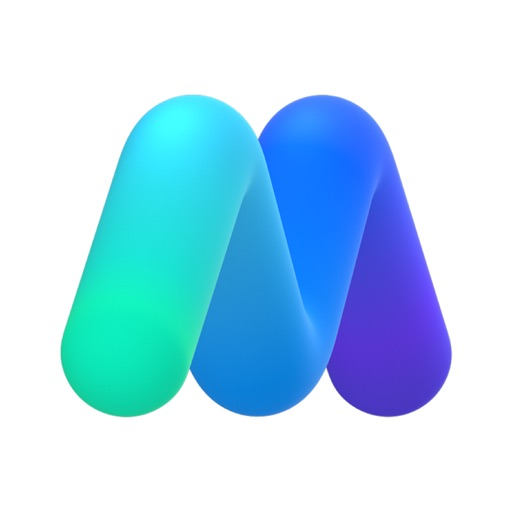
- **확인**: [ ] 정확 / [ ] 잘못됨 — 메모: 

## 보맵

- **ID**: `wwit_bomapp`
- **카테고리**: Finance | **지역**: Korea
- **아이콘**: ✅ `wwit_bomapp.png`
- **아이콘 미리보기**: 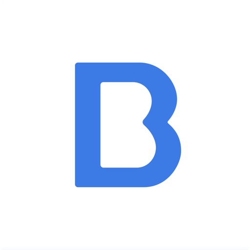
- **확인**: [ ] 정확 / [ ] 잘못됨 — 메모: 

## 아임인 imin

- **ID**: `wwit_imin`
- **카테고리**: Finance | **지역**: Korea
- **아이콘**: ✅ `wwit_imin.png`
- **아이콘 미리보기**: 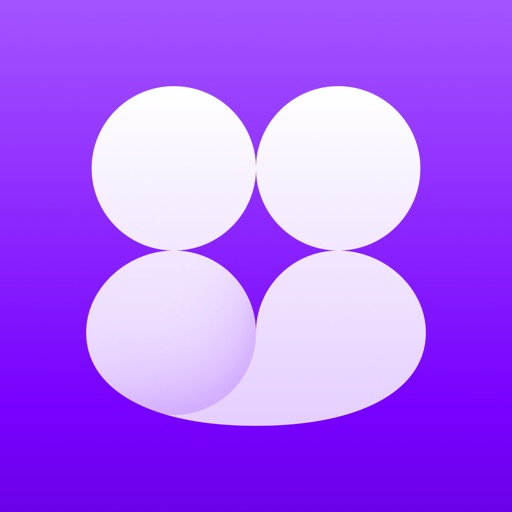
- **확인**: [ ] 정확 / [ ] 잘못됨 — 메모: 

## 코인원

- **ID**: `wwit_coinone`
- **카테고리**: Finance | **지역**: Korea
- **아이콘**: ✅ `wwit_coinone.png`
- **아이콘 미리보기**: 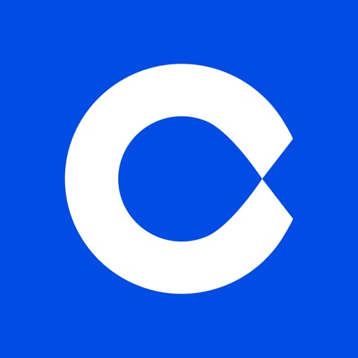
- **확인**: [ ] 정확 / [ ] 잘못됨 — 메모: 

## 토스

- **ID**: `wwit_toss`
- **카테고리**: Finance | **지역**: Korea
- **아이콘**: ✅ `wwit_toss.png`
- **아이콘 미리보기**: 
- **확인**: [ ] 정확 / [ ] 잘못됨 — 메모: 

## 핀크 (Finnq)

- **ID**: `wwit_finnq`
- **카테고리**: Finance | **지역**: Korea
- **아이콘**: ✅ `wwit_finnq.png`
- **아이콘 미리보기**: 
- **확인**: [ ] 정확 / [ ] 잘못됨 — 메모: 

## au PAY

- **ID**: `au-pay`
- **카테고리**: Finance | **지역**: Japan
- **아이콘**: ✅ `au-pay.png`
- **아이콘 미리보기**: 
- **확인**: [ ] 정확 / [ ] 잘못됨 — 메모: 

## d払い

- **ID**: `d-payment`
- **카테고리**: Finance | **지역**: Japan
- **아이콘**: ✅ `d-payment.png`
- **아이콘 미리보기**: 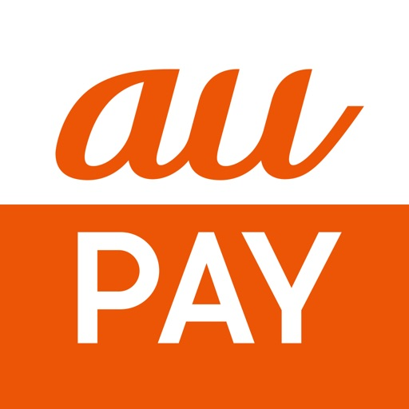
- **확인**: [ ] 정확 / [ ] 잘못됨 — 메모: 

## PayPay

- **ID**: `paypay`
- **카테고리**: Finance | **지역**: Japan
- **아이콘**: ✅ `paypay.png`
- **아이콘 미리보기**: 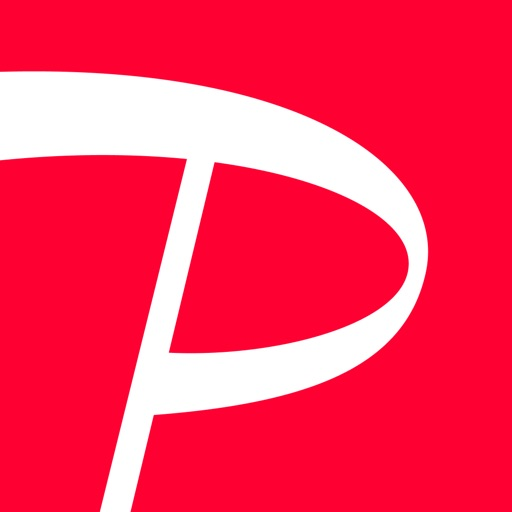
- **확인**: [ ] 정확 / [ ] 잘못됨 — 메모: 

## Vポイント

- **ID**: `v-point-pay`
- **카테고리**: Finance | **지역**: Japan
- **아이콘**: ✅ `v-point-pay.png`
- **아이콘 미리보기**: 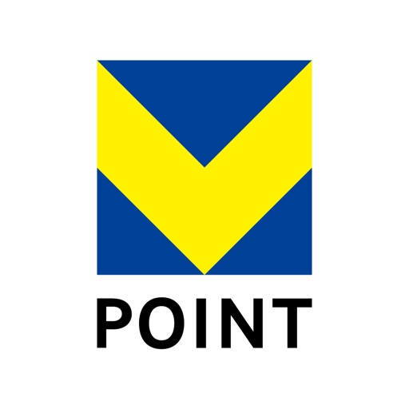
- **확인**: [ ] 정확 / [ ] 잘못됨 — 메모: 

## Zaim

- **ID**: `zaim`
- **카테고리**: Finance | **지역**: Japan
- **아이콘**: ✅ `zaim.png`
- **아이콘 미리보기**: 
- **확인**: [ ] 정확 / [ ] 잘못됨 — 메모: 

## マネーフォワード ME

- **ID**: `moneyforward`
- **카테고리**: Finance | **지역**: Japan
- **아이콘**: ✅ `moneyforward.png`
- **아이콘 미리보기**: 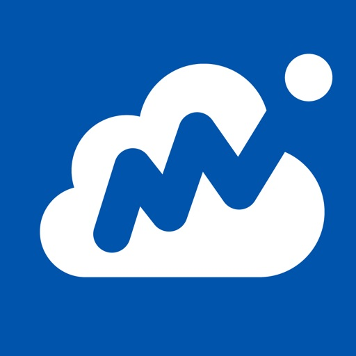
- **확인**: [ ] 정확 / [ ] 잘못됨 — 메모: 

## Cash App

- **ID**: `cash-app`
- **카테고리**: Finance | **지역**: Global
- **아이콘**: ✅ `cash-app.png`
- **아이콘 미리보기**: 
- **확인**: [ ] 정확 / [ ] 잘못됨 — 메모: 

## PayPal

- **ID**: `paypal`
- **카테고리**: Finance | **지역**: Global
- **아이콘**: ✅ `paypal.png`
- **아이콘 미리보기**: 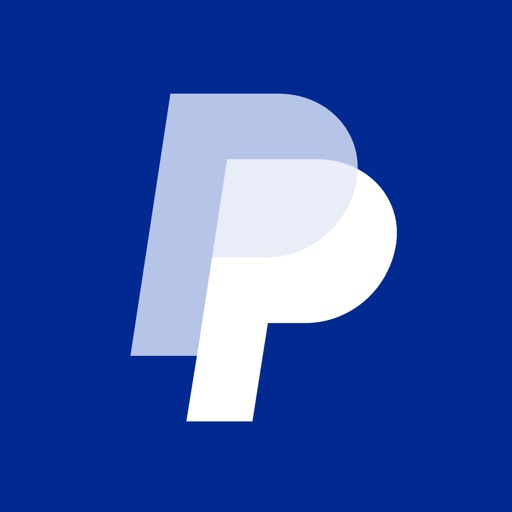
- **확인**: [ ] 정확 / [ ] 잘못됨 — 메모: 

## Toss

- **ID**: `toss`
- **카테고리**: Finance | **지역**: Korea
- **아이콘**: ✅ `toss.png`
- **아이콘 미리보기**: 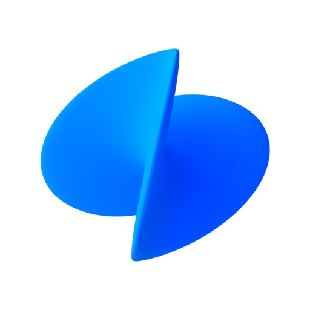
- **확인**: [ ] 정확 / [ ] 잘못됨 — 메모: 

## 배달의민족

- **ID**: `배달의민족`
- **카테고리**: Food | **지역**: Korea
- **아이콘**: ✅ `배달의민족.png`
- **아이콘 미리보기**: 
- **확인**: [ ] 정확 / [ ] 잘못됨 — 메모: 

## 스타벅스

- **ID**: `wwit_starbucks`
- **카테고리**: Food | **지역**: Korea
- **아이콘**: ✅ `wwit_starbucks.png`
- **아이콘 미리보기**: 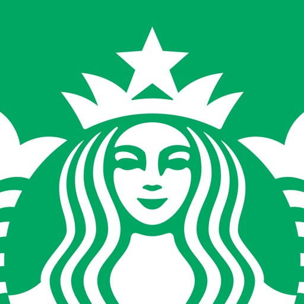
- **확인**: [ ] 정확 / [ ] 잘못됨 — 메모: 

## Uber Eats

- **ID**: `uber-eats`
- **카테고리**: Food | **지역**: Global
- **아이콘**: ✅ `uber-eats.png`
- **아이콘 미리보기**: 
- **확인**: [ ] 정확 / [ ] 잘못됨 — 메모: 

## 트로스트

- **ID**: `트로스트`
- **카테고리**: Health | **지역**: Korea
- **아이콘**: ✅ `트로스트.png`
- **아이콘 미리보기**: 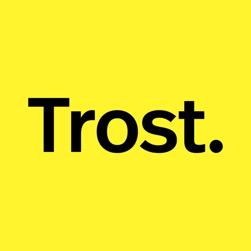
- **확인**: [ ] 정확 / [ ] 잘못됨 — 메모: 

## 플랜핏

- **ID**: `플랜핏`
- **카테고리**: Health | **지역**: Korea
- **아이콘**: ✅ `플랜핏.png`
- **아이콘 미리보기**: 
- **확인**: [ ] 정확 / [ ] 잘못됨 — 메모: 

## 필라이즈

- **ID**: `필라이즈`
- **카테고리**: Health | **지역**: Korea
- **아이콘**: ✅ `필라이즈.png`
- **아이콘 미리보기**: 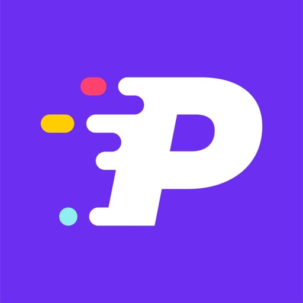
- **확인**: [ ] 정확 / [ ] 잘못됨 — 메모: 

## FLO – 플로

- **ID**: `wwit_flo`
- **카테고리**: Health | **지역**: Korea
- **아이콘**: ✅ `wwit_flo.png`
- **아이콘 미리보기**: 
- **확인**: [ ] 정확 / [ ] 잘못됨 — 메모: 

## 코끼리

- **ID**: `wwit_elephant`
- **카테고리**: Health | **지역**: Korea
- **아이콘**: ✅ `wwit_elephant.png`
- **아이콘 미리보기**: 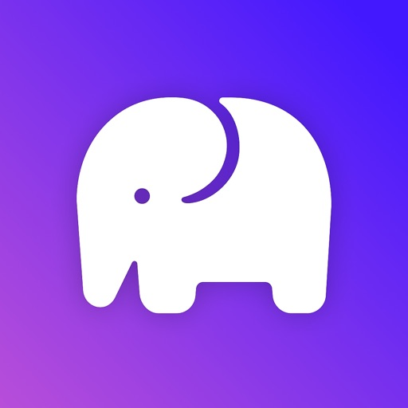
- **확인**: [ ] 정확 / [ ] 잘못됨 — 메모: 

## Ahead

- **ID**: `ahead`
- **카테고리**: Health | **지역**: Global
- **아이콘**: ✅ `ahead.png`
- **아이콘 미리보기**: 
- **확인**: [ ] 정확 / [ ] 잘못됨 — 메모: 

## Alan Mind

- **ID**: `alan-mind`
- **카테고리**: Health | **지역**: Global
- **아이콘**: ✅ `alan-mind.png`
- **아이콘 미리보기**: 
- **확인**: [ ] 정확 / [ ] 잘못됨 — 메모: 

## Apple Fitness

- **ID**: `apple-fitness`
- **카테고리**: Health | **지역**: Global
- **아이콘**: ✅ `apple-fitness.png`
- **아이콘 미리보기**: 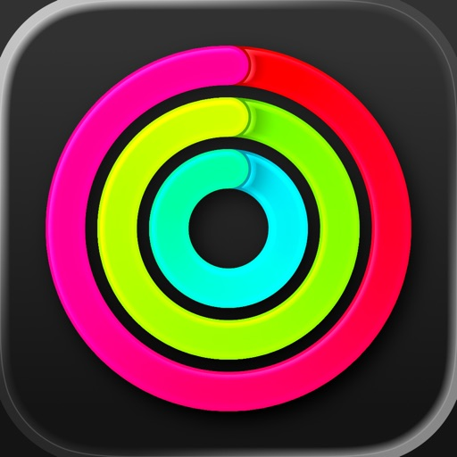
- **확인**: [ ] 정확 / [ ] 잘못됨 — 메모: 

## Bevel

- **ID**: `bevel`
- **카테고리**: Health | **지역**: Global
- **아이콘**: ✅ `bevel.png`
- **아이콘 미리보기**: 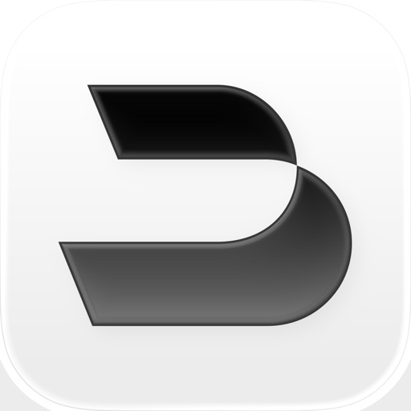
- **확인**: [ ] 정확 / [ ] 잘못됨 — 메모: 

## Cal AI

- **ID**: `cal-ai`
- **카테고리**: Health | **지역**: Global
- **아이콘**: ✅ `cal-ai.png`
- **아이콘 미리보기**: 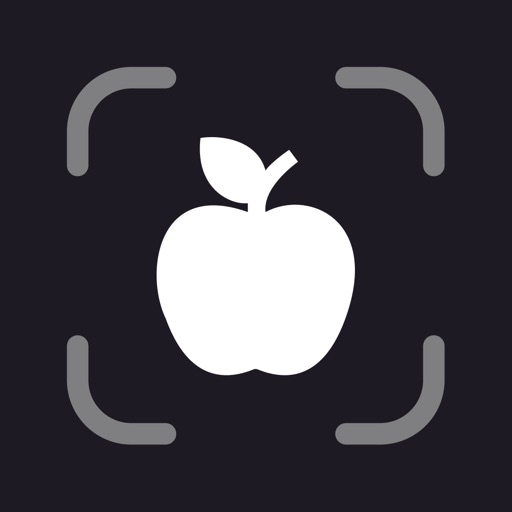
- **확인**: [ ] 정확 / [ ] 잘못됨 — 메모: 

## Calm

- **ID**: `calm`
- **카테고리**: Health | **지역**: Global
- **아이콘**: ✅ `calm.png`
- **아이콘 미리보기**: 
- **확인**: [ ] 정확 / [ ] 잘못됨 — 메모: 

## Calm Sleep

- **ID**: `calm-sleep`
- **카테고리**: Health | **지역**: Global
- **아이콘**: ✅ `calm-sleep.png`
- **아이콘 미리보기**: 
- **확인**: [ ] 정확 / [ ] 잘못됨 — 메모: 

## Fitbit

- **ID**: `fitbit`
- **카테고리**: Health | **지역**: Global
- **아이콘**: ✅ `fitbit.png`
- **아이콘 미리보기**: 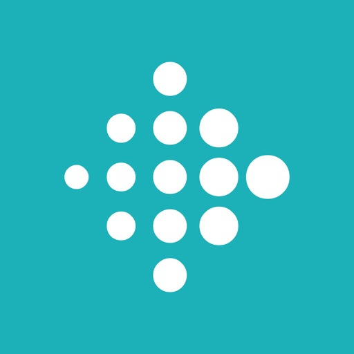
- **확인**: [ ] 정확 / [ ] 잘못됨 — 메모: 

## Flo

- **ID**: `flo`
- **카테고리**: Health | **지역**: Global
- **아이콘**: ✅ `flo.png`
- **아이콘 미리보기**: 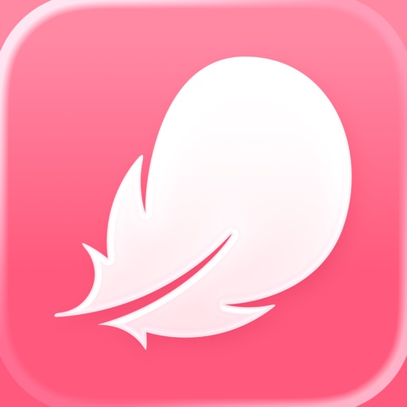
- **확인**: [ ] 정확 / [ ] 잘못됨 — 메모: 

## Headspace

- **ID**: `headspace`
- **카테고리**: Health | **지역**: Global
- **아이콘**: ✅ `headspace.png`
- **아이콘 미리보기**: 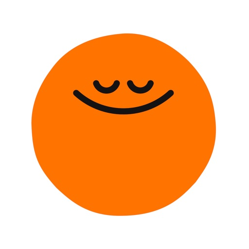
- **확인**: [ ] 정확 / [ ] 잘못됨 — 메모: 

## MyFitnessPal

- **ID**: `myfitnesspal`
- **카테고리**: Health | **지역**: Global
- **아이콘**: ✅ `myfitnesspal.png`
- **아이콘 미리보기**: 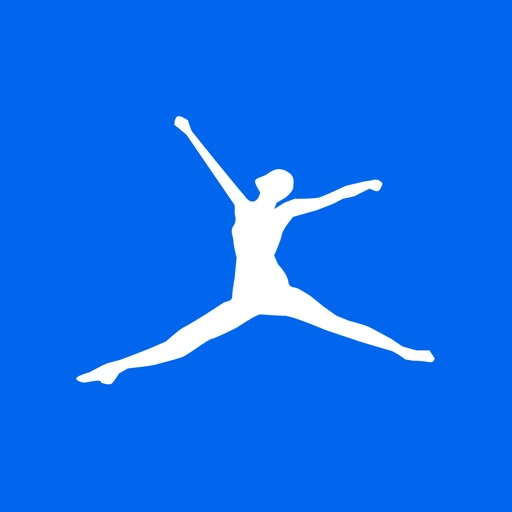
- **확인**: [ ] 정확 / [ ] 잘못됨 — 메모: 

## Nike Run Club

- **ID**: `nike-run-club`
- **카테고리**: Health | **지역**: Global
- **아이콘**: ✅ `nike-run-club.png`
- **아이콘 미리보기**: 
- **확인**: [ ] 정확 / [ ] 잘못됨 — 메모: 

## Strava

- **ID**: `strava`
- **카테고리**: Health | **지역**: Global
- **아이콘**: ✅ `strava.png`
- **아이콘 미리보기**: 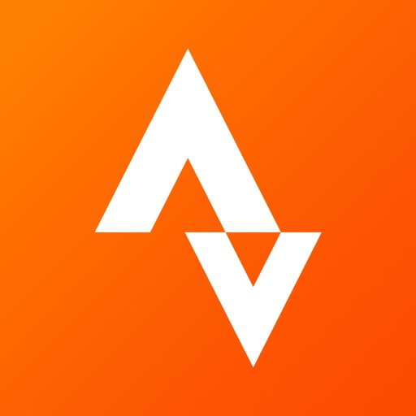
- **확인**: [ ] 정확 / [ ] 잘못됨 — 메모: 

## Zero

- **ID**: `zero`
- **카테고리**: Health | **지역**: Global
- **아이콘**: ✅ `zero.png`
- **아이콘 미리보기**: 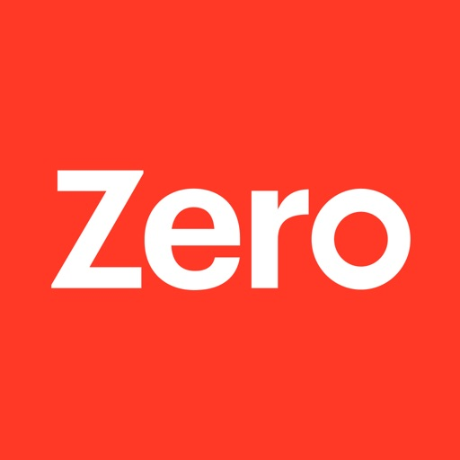
- **확인**: [ ] 정확 / [ ] 잘못됨 — 메모: 

## Bend

- **ID**: `bend`
- **카테고리**: Health | **지역**: Global
- **아이콘**: ✅ `bend.png`
- **아이콘 미리보기**: 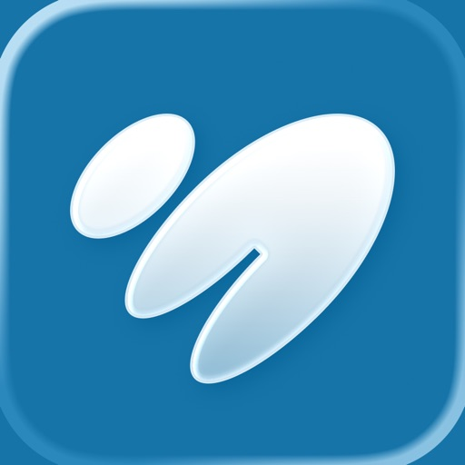
- **확인**: [ ] 정확 / [ ] 잘못됨 — 메모: 

## BitePal

- **ID**: `bitepal`
- **카테고리**: Health | **지역**: Global
- **아이콘**: ✅ `bitepal.png`
- **아이콘 미리보기**: 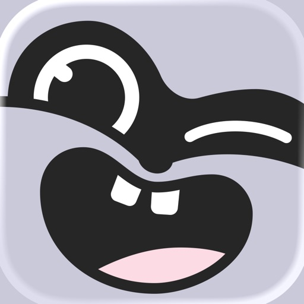
- **확인**: [ ] 정확 / [ ] 잘못됨 — 메모: 

## Callie

- **ID**: `callie`
- **카테고리**: Health | **지역**: Global
- **아이콘**: ✅ `callie.png`
- **아이콘 미리보기**: 
- **확인**: [ ] 정확 / [ ] 잘못됨 — 메모: 

## Lifesum

- **ID**: `lifesum`
- **카테고리**: Health | **지역**: Global
- **아이콘**: ✅ `lifesum.png`
- **아이콘 미리보기**: 
- **확인**: [ ] 정확 / [ ] 잘못됨 — 메모: 

## Noom

- **ID**: `noom`
- **카테고리**: Health | **지역**: Global
- **아이콘**: ✅ `noom.png`
- **아이콘 미리보기**: 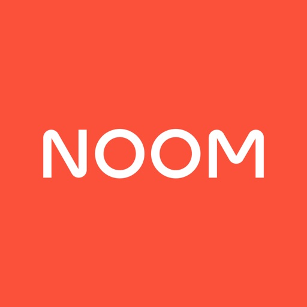
- **확인**: [ ] 정확 / [ ] 잘못됨 — 메모: 

## Stresswatch

- **ID**: `stresswatch`
- **카테고리**: Health | **지역**: Global
- **아이콘**: ✅ `stresswatch.png`
- **아이콘 미리보기**: 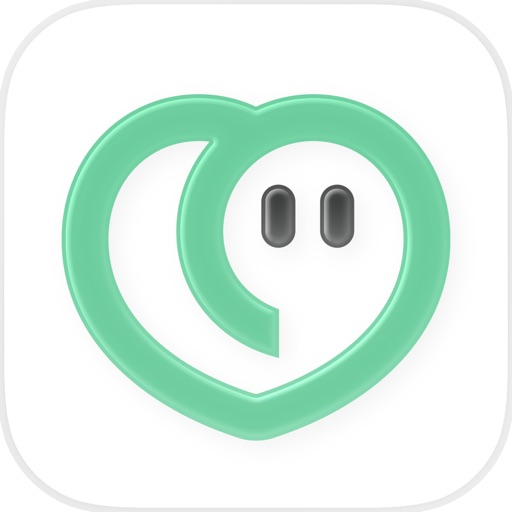
- **확인**: [ ] 정확 / [ ] 잘못됨 — 메모: 

## wakeout

- **ID**: `wakeout`
- **카테고리**: Health | **지역**: Global
- **아이콘**: ✅ `wakeout.png`
- **아이콘 미리보기**: 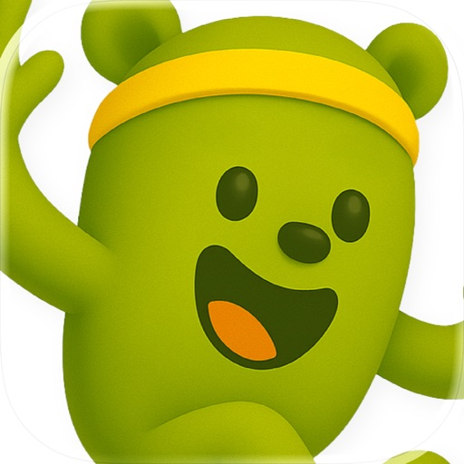
- **확인**: [ ] 정확 / [ ] 잘못됨 — 메모: 

## あすけん

- **ID**: `あすけん`
- **카테고리**: Health | **지역**: Japan
- **아이콘**: ✅ `あすけん.png`
- **아이콘 미리보기**: 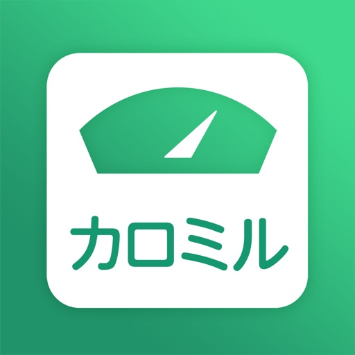
- **확인**: [ ] 정확 / [ ] 잘못됨 — 메모: 

## Google Fit

- **ID**: `google_fit`
- **카테고리**: Health | **지역**: Global
- **아이콘**: ✅ `google_fit.png`
- **아이콘 미리보기**: 
- **확인**: [ ] 정확 / [ ] 잘못됨 — 메모: 

## Pacer

- **ID**: `pacer`
- **카테고리**: Health | **지역**: Global
- **아이콘**: ✅ `pacer.png`
- **아이콘 미리보기**: 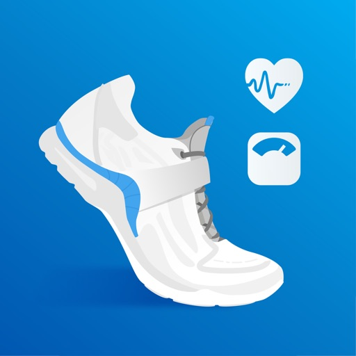
- **확인**: [ ] 정확 / [ ] 잘못됨 — 메모: 

## StepsApp Pedometer

- **ID**: `stepsapp`
- **카테고리**: Health | **지역**: Global
- **아이콘**: ✅ `stepsapp.png`
- **아이콘 미리보기**: 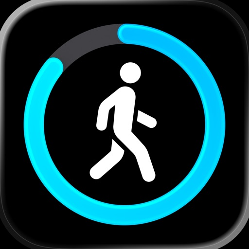
- **확인**: [ ] 정확 / [ ] 잘못됨 — 메모: 

## nightly

- **ID**: `nightly`
- **카테고리**: Health | **지역**: Global
- **아이콘**: ✅ `nightly.png`
- **아이콘 미리보기**: 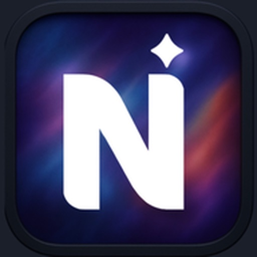
- **확인**: [ ] 정확 / [ ] 잘못됨 — 메모: 

## Pokemon Sleep

- **ID**: `pokemon_sleep`
- **카테고리**: Health | **지역**: Global
- **아이콘**: ✅ `pokemon_sleep.png`
- **아이콘 미리보기**: 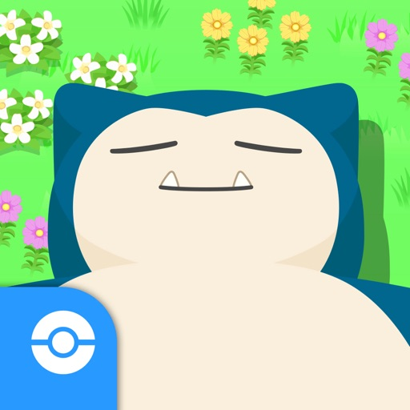
- **확인**: [ ] 정확 / [ ] 잘못됨 — 메모: 

## mmm 엠엠엠

- **ID**: `mmm_엠엠엠`
- **카테고리**: Lifestyle | **지역**: Korea
- **아이콘**: ✅ `mmm_엠엠엠.png`
- **아이콘 미리보기**: 
- **확인**: [ ] 정확 / [ ] 잘못됨 — 메모: 

## 닷슬래시대시

- **ID**: `닷슬래시대시`
- **카테고리**: Lifestyle | **지역**: Korea
- **아이콘**: ✅ `닷슬래시대시.png`
- **아이콘 미리보기**: 
- **확인**: [ ] 정확 / [ ] 잘못됨 — 메모: 

## 당근마켓

- **ID**: `당근마켓`
- **카테고리**: Lifestyle | **지역**: Korea
- **아이콘**: ✅ `당근마켓.png`
- **아이콘 미리보기**: 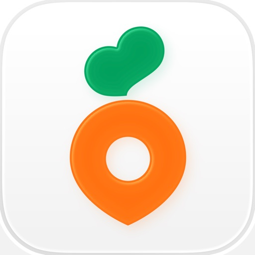
- **확인**: [ ] 정확 / [ ] 잘못됨 — 메모: 

## 런드리고

- **ID**: `런드리고`
- **카테고리**: Lifestyle | **지역**: Korea
- **아이콘**: ✅ `런드리고.png`
- **아이콘 미리보기**: 
- **확인**: [ ] 정확 / [ ] 잘못됨 — 메모: 

## 뤼튼

- **ID**: `뤼튼`
- **카테고리**: Lifestyle | **지역**: Korea
- **아이콘**: ✅ `뤼튼.png`
- **아이콘 미리보기**: 
- **확인**: [ ] 정확 / [ ] 잘못됨 — 메모: 

## 알라미

- **ID**: `알라미`
- **카테고리**: Lifestyle | **지역**: Korea
- **아이콘**: ✅ `알라미.png`
- **아이콘 미리보기**: 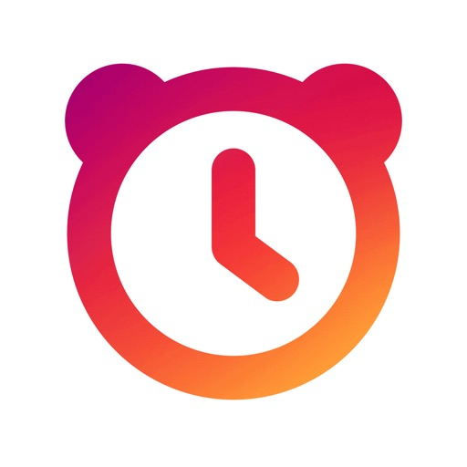
- **확인**: [ ] 정확 / [ ] 잘못됨 — 메모: 

## 치지직 CHZZK

- **ID**: `치지직_chzzk`
- **카테고리**: Lifestyle | **지역**: Korea
- **아이콘**: ✅ `치지직_chzzk.png`
- **아이콘 미리보기**: 
- **확인**: [ ] 정확 / [ ] 잘못됨 — 메모: 

## 호갱노노

- **ID**: `호갱노노`
- **카테고리**: Lifestyle | **지역**: Korea
- **아이콘**: ✅ `호갱노노.png`
- **아이콘 미리보기**: 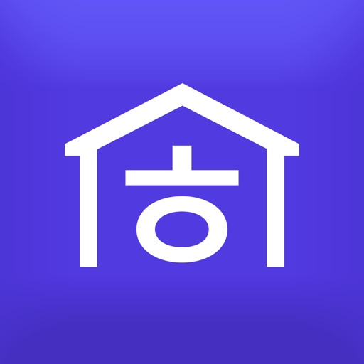
- **확인**: [ ] 정확 / [ ] 잘못됨 — 메모: 

## LG ThinQ

- **ID**: `wwit_lgthinq`
- **카테고리**: Lifestyle | **지역**: Korea
- **아이콘**: ✅ `wwit_lgthinq.png`
- **아이콘 미리보기**: 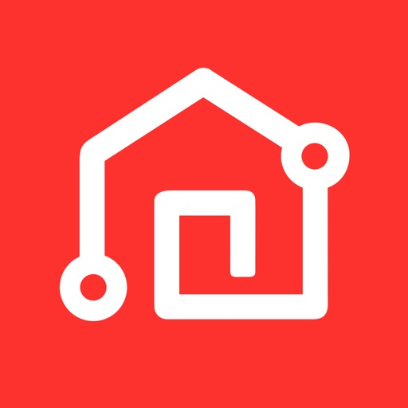
- **확인**: [ ] 정확 / [ ] 잘못됨 — 메모: 

## Lifeplus

- **ID**: `wwit_lifeplus`
- **카테고리**: Lifestyle | **지역**: Korea
- **아이콘**: ✅ `wwit_lifeplus.png`
- **아이콘 미리보기**: 
- **확인**: [ ] 정확 / [ ] 잘못됨 — 메모: 

## 미소

- **ID**: `wwit_miso`
- **카테고리**: Lifestyle | **지역**: Korea
- **아이콘**: ✅ `wwit_miso.png`
- **아이콘 미리보기**: 
- **확인**: [ ] 정확 / [ ] 잘못됨 — 메모: 

## 밀리의 서재

- **ID**: `wwit_millie`
- **카테고리**: Lifestyle | **지역**: Korea
- **아이콘**: ✅ `wwit_millie.png`
- **아이콘 미리보기**: 
- **확인**: [ ] 정확 / [ ] 잘못됨 — 메모: 

## 세탁특공대

- **ID**: `wwit_setak`
- **카테고리**: Lifestyle | **지역**: Korea
- **아이콘**: ✅ `wwit_setak.png`
- **아이콘 미리보기**: 
- **확인**: [ ] 정확 / [ ] 잘못됨 — 메모: 

## 직방

- **ID**: `wwit_zigbang`
- **카테고리**: Lifestyle | **지역**: Korea
- **아이콘**: ✅ `wwit_zigbang.png`
- **아이콘 미리보기**: 
- **확인**: [ ] 정확 / [ ] 잘못됨 — 메모: 

## 텍스처 texture

- **ID**: `wwit_texture`
- **카테고리**: Lifestyle | **지역**: Korea
- **아이콘**: ✅ `wwit_texture.png`
- **아이콘 미리보기**: 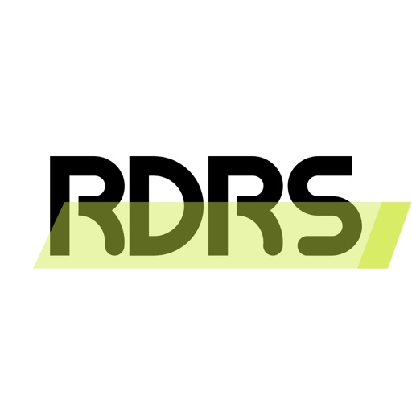
- **확인**: [ ] 정확 / [ ] 잘못됨 — 메모: 

## 현대카드 DIVE

- **ID**: `wwit_dive`
- **카테고리**: Lifestyle | **지역**: Korea
- **아이콘**: ✅ `wwit_dive.png`
- **아이콘 미리보기**: 
- **확인**: [ ] 정확 / [ ] 잘못됨 — 메모: 

## Airbnb

- **ID**: `airbnb`
- **카테고리**: Lifestyle | **지역**: Global
- **아이콘**: ✅ `airbnb.png`
- **아이콘 미리보기**: 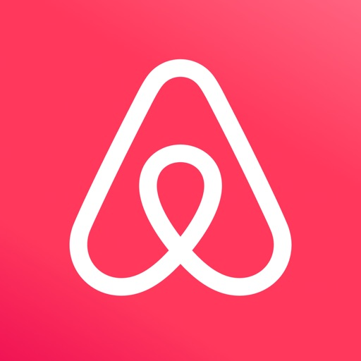
- **확인**: [ ] 정확 / [ ] 잘못됨 — 메모: 

## Spotify

- **ID**: `spotify`
- **카테고리**: Lifestyle | **지역**: Global
- **아이콘**: ✅ `spotify.png`
- **아이콘 미리보기**: 
- **확인**: [ ] 정확 / [ ] 잘못됨 — 메모: 

## 캐시슬라이드

- **ID**: `wwit_cashslide`
- **카테고리**: Rewards | **지역**: Korea
- **아이콘**: ✅ `wwit_cashslide.png`
- **아이콘 미리보기**: 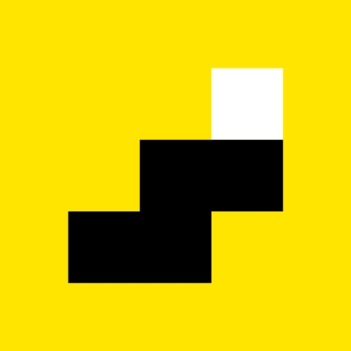
- **확인**: [ ] 정확 / [ ] 잘못됨 — 메모: 

## トリマ (Torima)

- **ID**: `torima`
- **카테고리**: Rewards | **지역**: Japan
- **아이콘**: ✅ `torima.png`
- **아이콘 미리보기**: 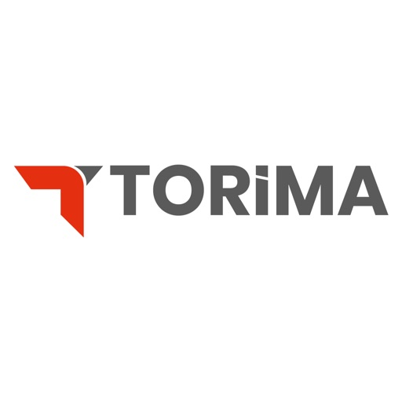
- **확인**: [ ] 정확 / [ ] 잘못됨 — 메모: 

## クラシルリワード

- **ID**: `kurashiru-rewards`
- **카테고리**: Rewards | **지역**: Japan
- **아이콘**: ✅ `kurashiru-rewards.png`
- **아이콘 미리보기**: 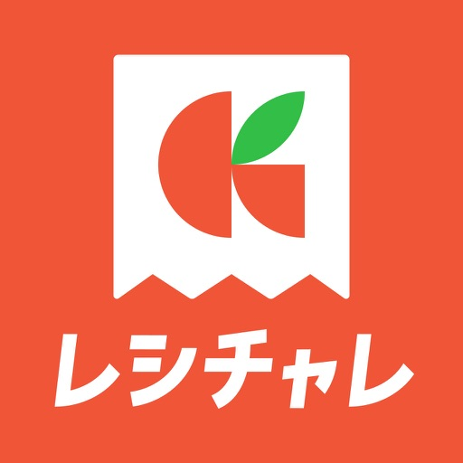
- **확인**: [ ] 정확 / [ ] 잘못됨 — 메모: 

## Fetch

- **ID**: `fetch`
- **카테고리**: Rewards | **지역**: Global
- **아이콘**: ✅ `fetch.png`
- **아이콘 미리보기**: 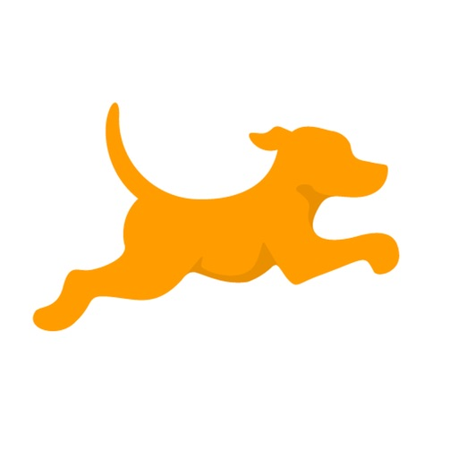
- **확인**: [ ] 정확 / [ ] 잘못됨 — 메모: 

## Rakuten

- **ID**: `rakuten`
- **카테고리**: Rewards | **지역**: Global
- **아이콘**: ✅ `rakuten.png`
- **아이콘 미리보기**: 
- **확인**: [ ] 정확 / [ ] 잘못됨 — 메모: 

## Sweatcoin

- **ID**: `sweatcoin`
- **카테고리**: Rewards | **지역**: Global
- **아이콘**: ✅ `sweatcoin.png`
- **아이콘 미리보기**: 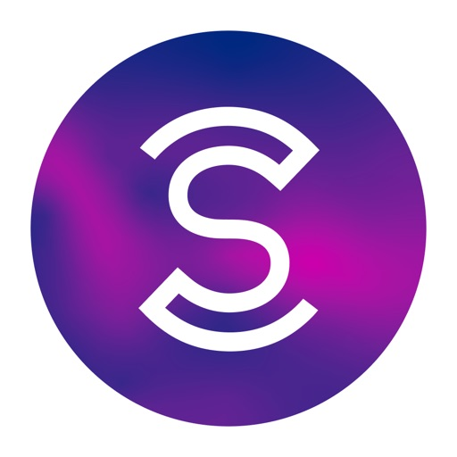
- **확인**: [ ] 정확 / [ ] 잘못됨 — 메모: 

## Freecash

- **ID**: `freecash`
- **카테고리**: Rewards | **지역**: Global
- **아이콘**: ✅ `freecash.png`
- **아이콘 미리보기**: 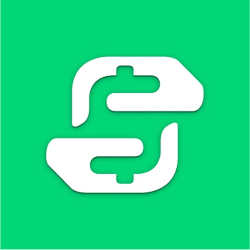
- **확인**: [ ] 정확 / [ ] 잘못됨 — 메모: 

## 비트버니

- **ID**: `bitbuni`
- **카테고리**: Rewards | **지역**: Korea
- **아이콘**: ✅ `bitbuni.png`
- **아이콘 미리보기**: 
- **확인**: [ ] 정확 / [ ] 잘못됨 — 메모: 

## 오락

- **ID**: `orak`
- **카테고리**: Rewards | **지역**: Korea
- **아이콘**: ✅ `orak.png`
- **아이콘 미리보기**: 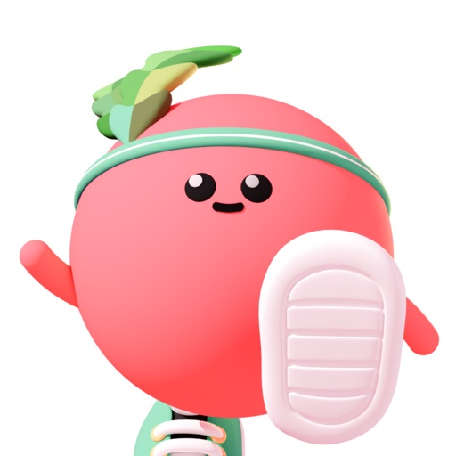
- **확인**: [ ] 정확 / [ ] 잘못됨 — 메모: 

## 캐시워크

- **ID**: `cashwalk`
- **카테고리**: Rewards | **지역**: Korea
- **아이콘**: ✅ `cashwalk.png`
- **아이콘 미리보기**: 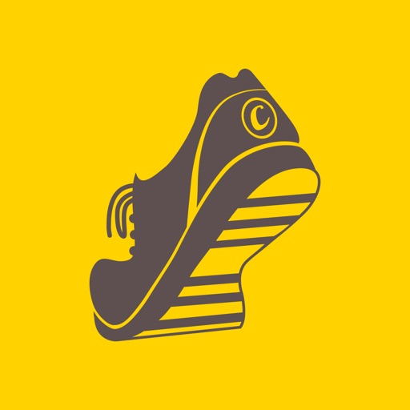
- **확인**: [ ] 정확 / [ ] 잘못됨 — 메모: 

## 야핏무브

- **ID**: `야핏무브`
- **카테고리**: Rewards | **지역**: Korea
- **아이콘**: ✅ `야핏무브.png`
- **아이콘 미리보기**: 
- **확인**: [ ] 정확 / [ ] 잘못됨 — 메모: 

## winwalk

- **ID**: `winwalk`
- **카테고리**: Rewards | **지역**: Global
- **아이콘**: ✅ `winwalk.png`
- **아이콘 미리보기**: 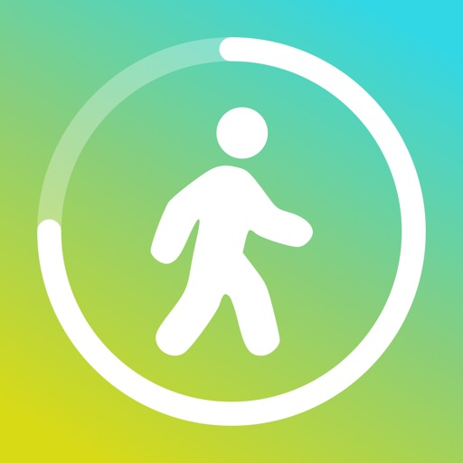
- **확인**: [ ] 정확 / [ ] 잘못됨 — 메모: 

## 슬립머니

- **ID**: `슬립머니`
- **카테고리**: Rewards | **지역**: Korea
- **아이콘**: ❌ `없음`
- **확인**: [ ] 정확 / [ ] 잘못됨 — 메모: 

## cashwalk_jp

- **ID**: `cashwalk_jp`
- **카테고리**: Rewards | **지역**: Japan
- **아이콘**: ✅ `cashwalk_jp.png`
- **아이콘 미리보기**: 
- **확인**: [ ] 정확 / [ ] 잘못됨 — 메모: 

## cashwalk_us

- **ID**: `cashwalk_us`
- **카테고리**: Rewards | **지역**: Global
- **아이콘**: ✅ `cashwalk_us.png`
- **아이콘 미리보기**: 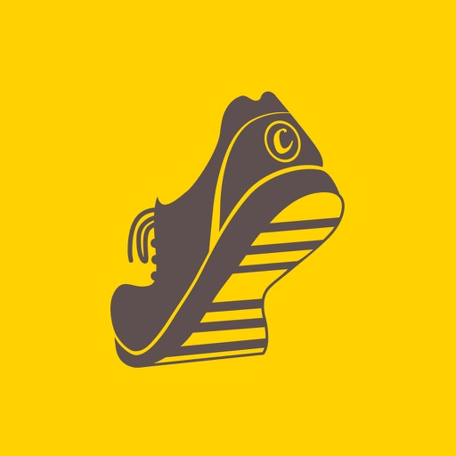
- **확인**: [ ] 정확 / [ ] 잘못됨 — 메모: 

## macadam

- **ID**: `macadam`
- **카테고리**: Rewards | **지역**: Global
- **아이콘**: ✅ `macadam.png`
- **아이콘 미리보기**: 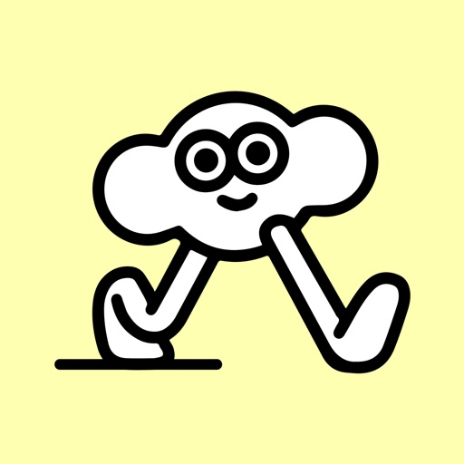
- **확인**: [ ] 정확 / [ ] 잘못됨 — 메모: 

## weward

- **ID**: `weward`
- **카테고리**: Rewards | **지역**: Global
- **아이콘**: ✅ `weward.png`
- **아이콘 미리보기**: 
- **확인**: [ ] 정확 / [ ] 잘못됨 — 메모: 

## 돈이돼지

- **ID**: `moneypig`
- **카테고리**: Rewards | **지역**: Korea
- **아이콘**: ✅ `moneypig.png`
- **아이콘 미리보기**: 
- **확인**: [ ] 정확 / [ ] 잘못됨 — 메모: 

## 지그재그

- **ID**: `지그재그`
- **카테고리**: Shopping | **지역**: Korea
- **아이콘**: ✅ `지그재그.png`
- **아이콘 미리보기**: 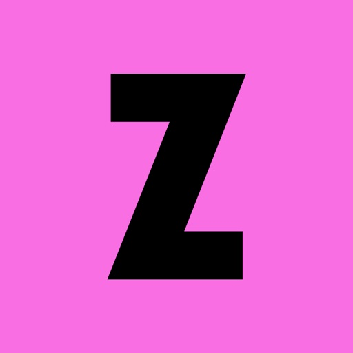
- **확인**: [ ] 정확 / [ ] 잘못됨 — 메모: 

## 쿠팡

- **ID**: `쿠팡`
- **카테고리**: Shopping | **지역**: Korea
- **아이콘**: ✅ `쿠팡.png`
- **아이콘 미리보기**: 
- **확인**: [ ] 정확 / [ ] 잘못됨 — 메모: 

## 29CM

- **ID**: `wwit_29cm`
- **카테고리**: Shopping | **지역**: Korea
- **아이콘**: ✅ `wwit_29cm.png`
- **아이콘 미리보기**: 
- **확인**: [ ] 정확 / [ ] 잘못됨 — 메모: 

## KREAM (크림)

- **ID**: `wwit_kream`
- **카테고리**: Shopping | **지역**: Korea
- **아이콘**: ✅ `wwit_kream.png`
- **아이콘 미리보기**: 
- **확인**: [ ] 정확 / [ ] 잘못됨 — 메모: 

## 마켓컬리

- **ID**: `wwit_marketkulry`
- **카테고리**: Shopping | **지역**: Korea
- **아이콘**: ✅ `wwit_marketkulry.png`
- **아이콘 미리보기**: 
- **확인**: [ ] 정확 / [ ] 잘못됨 — 메모: 

## 오늘의집

- **ID**: `wwit_ohouse`
- **카테고리**: Shopping | **지역**: Korea
- **아이콘**: ✅ `wwit_ohouse.png`
- **아이콘 미리보기**: 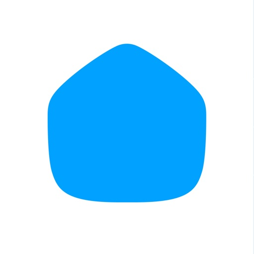
- **확인**: [ ] 정확 / [ ] 잘못됨 — 메모: 

## Target

- **ID**: `target`
- **카테고리**: Shopping | **지역**: Global
- **아이콘**: ✅ `target.png`
- **아이콘 미리보기**: 
- **확인**: [ ] 정확 / [ ] 잘못됨 — 메모: 

## Walmart

- **ID**: `walmart`
- **카테고리**: Shopping | **지역**: Global
- **아이콘**: ✅ `walmart.png`
- **아이콘 미리보기**: 
- **확인**: [ ] 정확 / [ ] 잘못됨 — 메모: 

## revolt 리볼트

- **ID**: `revolt_리볼트`
- **카테고리**: Transport | **지역**: Korea
- **아이콘**: ✅ `revolt_리볼트.png`
- **아이콘 미리보기**: 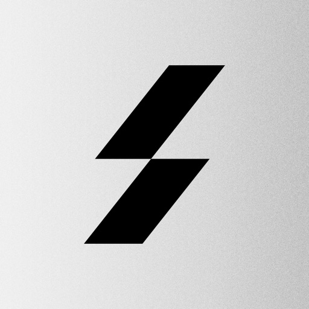
- **확인**: [ ] 정확 / [ ] 잘못됨 — 메모: 

## 카닥

- **ID**: `카닥`
- **카테고리**: Transport | **지역**: Korea
- **아이콘**: ✅ `카닥.png`
- **아이콘 미리보기**: 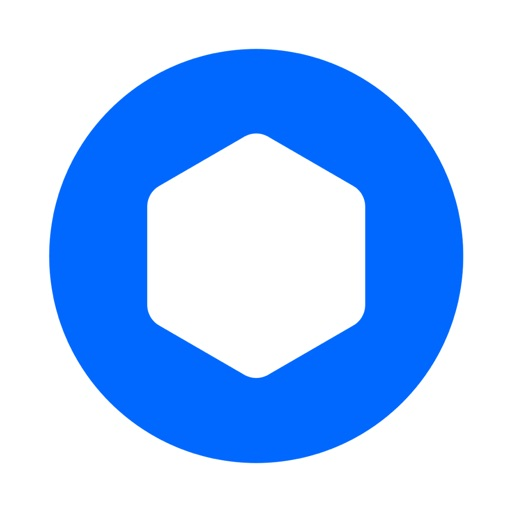
- **확인**: [ ] 정확 / [ ] 잘못됨 — 메모: 

## 타다 TADA

- **ID**: `타다_tada`
- **카테고리**: Transport | **지역**: Korea
- **아이콘**: ✅ `타다_tada.png`
- **아이콘 미리보기**: 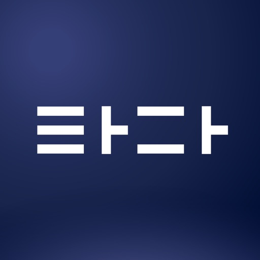
- **확인**: [ ] 정확 / [ ] 잘못됨 — 메모: 

## 헤이딜러

- **ID**: `헤이딜러`
- **카테고리**: Transport | **지역**: Korea
- **아이콘**: ✅ `헤이딜러.png`
- **아이콘 미리보기**: 
- **확인**: [ ] 정확 / [ ] 잘못됨 — 메모: 

## 카카오 T

- **ID**: `wwit_kakaot`
- **카테고리**: Transport | **지역**: Korea
- **아이콘**: ✅ `wwit_kakaot.png`
- **아이콘 미리보기**: 
- **확인**: [ ] 정확 / [ ] 잘못됨 — 메모: 

## Uber

- **ID**: `uber`
- **카테고리**: Transport | **지역**: Global
- **아이콘**: ✅ `uber.png`
- **아이콘 미리보기**: 
- **확인**: [ ] 정확 / [ ] 잘못됨 — 메모: 

## bolt

- **ID**: `bolt`
- **카테고리**: Transport | **지역**: Global
- **아이콘**: ✅ `bolt.png`
- **아이콘 미리보기**: 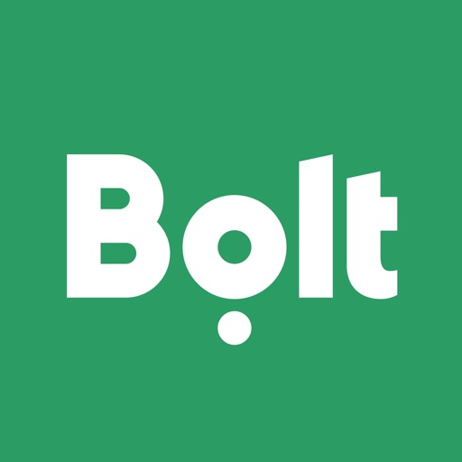
- **확인**: [ ] 정확 / [ ] 잘못됨 — 메모: 
